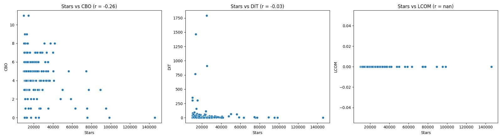
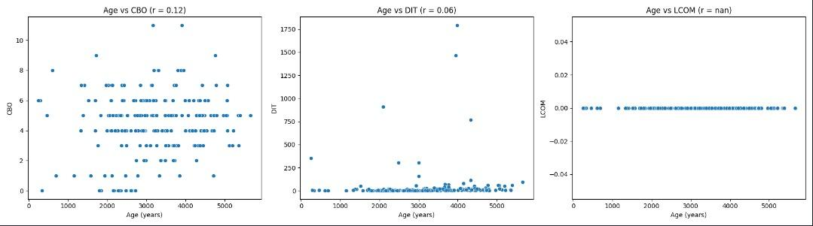
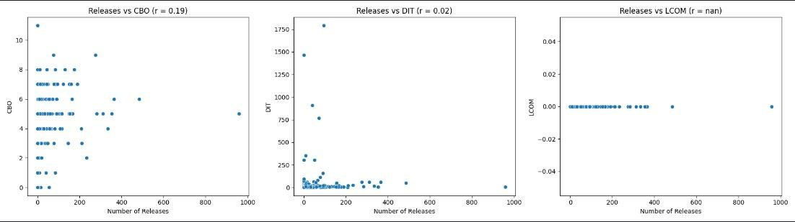
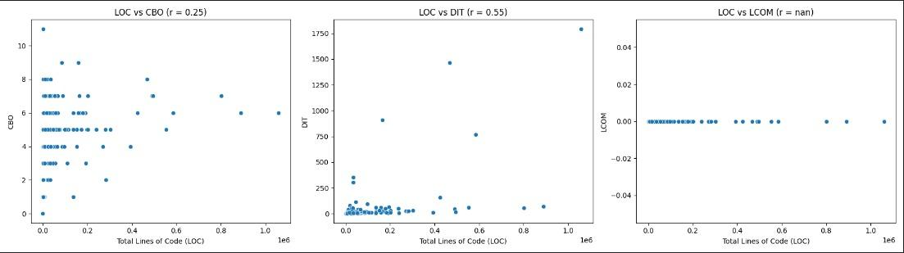

# Análise de Repositórios Populares de Código Aberto no GitHub

## 1. Introdução

Neste estudo, realizou-se uma análise de repositórios Java populares no GitHub, explorando as correlações entre atributos dos repositórios (como popularidade, idade e atividade) e algumas métricas de qualidade de código definidas pelo conjunto de métricas CK (Chidamber e Kemerer) — como CBO, DIT, LCOM\*. Nesse contexto, o objetivo é avaliar a correlação de características de qualidade e fatores como popularidade ou idade dos repositórios.

- **RQ 01:** Qual é a correlação entre a popularidade dos repositórios e suas características de qualidade?
- **RQ 02:** Qual é a correlação entre a maturidade dos repositórios e suas características de qualidade?
- **RQ 03:** Qual é a correlação entre a atividade dos repositórios e suas características de qualidade?
- **RQ 04:** Qual é a correlação entre o tamanho dos repositórios e suas características de qualidade?

## 2. Hipóteses Informais

De forma preliminar, elaborou-se as seguintes hipóteses informais para posterior verificação:

- Espera-se que repositórios mais populares (em número de estrelas) apresentem melhor qualidade de código, já que a popularidade pode indicar maior engajamento da comunidade e padrões de código mais elevados.
- Espera-se que repositórios mais maduros terão melhores métricas de qualidade, devido ao maior tempo disponível para refinamento e reestruturação.
- Espera-se que repositórios mais ativos exibirão melhores métricas de qualidade, em função da maior constância de desenvolvimento e manutenção.
- Espera-se que repositórios maiores (em linhas de código) apresentarão piores métricas de qualidade devido à maior complexidade e consequente dificuldade de manutenção.

## 3. Metodologia

A coleta de dados foi realizada a partir da API do GitHub e implementada via GraphQL, buscando os 1.000 repositórios com maior número de estrelas. Para cálculo de métricas CK, utilizou-se a versão standalone da ferramenta de análise estática de código 'CK'[^1], elaborada pelo desenvolvedor [@mauricioaniche](https://www.github.com/mauricioaniche).

Para se obter a correlação entre diferentes métricas, utilizou-se o Coeficiente de Correlação de Pearson, implementado a pela biblioteca _pearsonr_[^2]. A visualização de dados foi obtida a partir das bibliotecas _seaborn_ e _matplotlib_

[^1]: [mauricioaniche/ck GitHub Repository](https://github.com/mauricioaniche/ck).
[^2]: [Scipy's personr](https://docs.scipy.org/doc/scipy/reference/generated/scipy.stats.pearsonr.html)

As seguintes métricas foram utilizadas para cada pergunta de pesquisa:

#### RQ 01: "Qual a relação entre a popularidade dos repositórios e as suas características de qualidade?"

`stars_vs_quality`: correlação entre a quantidade total de estrelas e métricas de qualidade (CBO, DIT, LCOM\*)

#### RQ 02: "Qual a relação entre a atualização dos repositórios e as suas características de qualidade?"

`age_vs_quality`: correlação entre a idade do repositório e métricas de qualidade (CBO, DIT, LCOM\*)

#### RQ 03: "Qual a relação entre a atividade dos repositórios e as suas características de qualidade?"

`activity_vs_quality`: correlação entre o número de lançamentos e métricas de qualidade (CBO, DIT, LCOM\*)

#### RQ 04: "Qual a relação entre o tamanho dos repositórios e suas características de qualidade?"

`size_vs_quality`: correlação entre o total de linhas de código (LOC) e linhas de comentários com métricas de qualidade (CBO, DIT, LCOM\*)

### 3.1. Métricas de Processo

| **Métrica**                 | **Definição**                                  |
| --------------------------- | ---------------------------------------------- |
| Popularidade do repositório | Quantidade total de estrelas                   |
| Tamanho da base de código   | Linhas de código (LOC) e linhas de comentários |
| Atividade do projeto        | Número de lançamentos                          |
| Idade do repositório        | Idade de cada repositório coletado             |

### 3.2. Métricas de qualidade

| **Métrica**                             | **Definição**                                                         | **Método de Sumarização** |
| --------------------------------------- | --------------------------------------------------------------------- | ------------------------- |
| **CBO:** Coupling between objects       | Número de dependências que uma classe possui                          | Média                     |
| **DIT:** Depth of Inheritance Tree      | Número de níveis que uma classe está na raiz da hierarquia de herança | Máximo                    |
| **LCOM\*:** Lack of Cohesion of Methods | Grau de coesão do método numa classe, normalizado entre 0 e 1         | Média                     |

## 4. Resultados

### 4.1. Exemplo de dados coletados e calculados

Abaixo estão exemplos de atributos de repositório coletados e métricas de qualidade calculadas para uma seleção de repositórios Java:

| **Repositório**          | **Estrelas** | **Idade (dias)** | **Releases** | **LOC** | **CBO** | **DIT** | **LCOM\*** |
| ------------------------ | ------------ | ---------------- | ------------ | ------- | ------- | ------- | ---------- |
| **hello-algo**           | 95.255       | 691              | 8            | 7164    | 1.87    | 1.0     | 0.07       |
| **java-design-patterns** | 89.305       | 3700             | 0            | 26237   | 3.36    | 6.0     | 0.13       |
| **mall**                 | 77.289       | 2367             | 3            | 55863   | 3.86    | 4.0     | 0.38       |
| **LeetCodeAnimation**    | 75.302       | 2120             | 0            | 68      | 1.0     | 1.0     | 0.05       |

## 5. Análise de resultados

Ao comparar as hipóteses formuladas com os resultados encontrados através da coleta de dados, pode-se observar:

### 5.1. Popularidade e Qualidade (RQ-01)

Ao se analisar a correlação entre popularidade com as métricas CK, a distribuição de maior destaque foi a que analisa DIT e número de estrelas dos repositórios. No geral, as instâncias se concentram em proximidade ao eixo inferior, indicando a DIT pouco afeta a popularidade de repositórios. No entanto, a tendência é que outliers de maior DIT possuam menor número de estrelas.

Ademais, não foi possível verificar relação direta entre CBO e Popularidade, uma vez que a distribuição dos repositórios não indica concentrações notáveis.

### 5.2. Maturidade e Qualidade (RQ-02)

Quanto à correlação entre maturidade e qualidade, é relevante analisar os outliers na relação entre DIT e idade do repositório. Dessa maneira, dos repositórios que apresentaram valores contrastantemente superiores de DIT, grande parte possui entre 10 a 13 anos de idade.

Ademais, também é notável a constância entre maturidade do repositório e LCOM, indicando que há pouco desvios no que se refere a essa correlação.

### 5.3. Atividade e Qualidade (RQ-03)

De forma geral, pode se atestar que os valores de LCOM se mantêm constantes em relação à atividade do repositório, seguindo o mesmo padrão das demais métricas.

### 5.4. Tamanho e Qualidade (RQ-04)

A correlação entre tamanho e qualidade também apresentou distribuições semelhantes às demais análises. No entanto, é possível perceber alguns outliers no que se refere à DIT vs tamanho do código, um deles sendo um repositório que possui valores aberrantes tanto de DIT quanto de linhas de código.  

